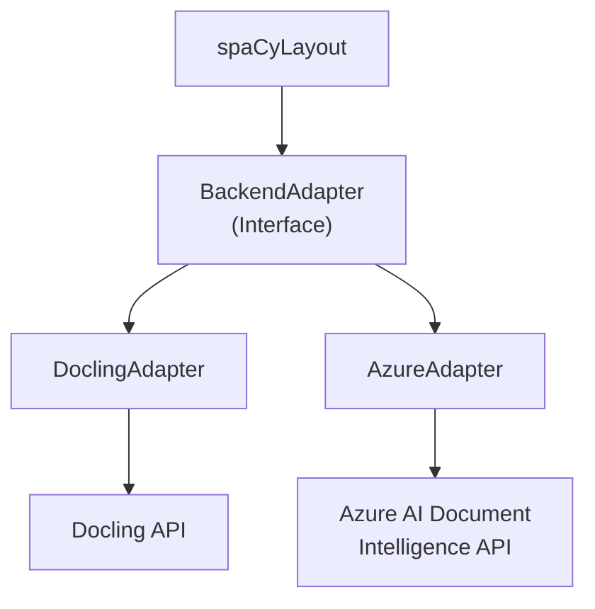

# Implementation Plan: Azure AI Document Intelligence for spaCy-Layout

## 1. Project Overview

This project aims to extend spaCy-Layout to support Azure AI Document
Intelligence as an alternative to Docling for PDF/document processing. The
implementation will maintain the existing spaCy-Layout API while allowing users
to choose between Docling and Azure as the backend processor.

The integration will enable users to:
- Process documents using Azure AI Document Intelligence
- Convert Azure's output to spaCy's Doc objects with layout information
- Maintain the same interface and features as the current Docling implementation
- Seamlessly switch between backends as needed

## 2. Architecture

We'll use an adapter-based architecture that:
1. Keeps `spaCyLayout` as the main public interface
2. Introduces backend adapters to handle specific document processors
3. Normalizes different outputs into a consistent format for spaCy integration

### Component Diagram

```
+----------------+     +----------------------+
|                |     |                      |
|  spaCyLayout   +---->+  BackendAdapter      |
|                |     |  (Interface)         |
+----------------+     +----------+-----------+
                                  |
                +-----------------+------------------+
                |                                    |
    +-----------v-----------+         +-------------v-----------+
    |                       |         |                         |
    |  DoclingAdapter       |         |  AzureAdapter           |
    |                       |         |                         |
    +-----------+-----------+         +-------------+-----------+
                |                                   |
    +-----------v-----------+         +-------------v-----------+
    |                       |         |                         |
    |  Docling API          |         |  Azure AI Document      |
    |                       |         |  Intelligence API        |
    +-----------------------+         +-------------------------+
```

Diagram also in mermaid:


### Key Components

1. **spaCyLayout**: Main class that users interact with, responsible for
   converting document processing results to spaCy Doc objects.
2. **BackendAdapter**: Abstract interface that defines the contract for document
   processing backends.
3. **DoclingAdapter**: Implements BackendAdapter for Docling, mostly wrapping
   existing functionality.
4. **AzureAdapter**: Implements BackendAdapter for Azure AI Document
   Intelligence, mapping Azure's output format to match what spaCyLayout
   expects.

## 3. Implementation Steps

### Phase 1: Foundation - Adapter Interface
- [x] **Create adapter interface** (Complexity: Low)
  - [x] Create directory structure for adapters
  - [x] Define `BackendAdapter` abstract base class
  - [x] Document interface methods and requirements

  **Dependencies**: None **Risks**: Ensuring the interface is flexible enough
  for different backends

```python
# spacy_layout/adapters/base.py
from abc import ABC, abstractmethod
from pathlib import Path
from typing import Any, Union

from docling_core.types.doc.document import DoclingDocument


class BackendAdapter(ABC):
    """Interface for document processing backend adapters."""

    @abstractmethod
    def convert(self, source: Union[str, Path, bytes]) -> DoclingDocument:
        """
        Convert a document source to a DoclingDocument.

        Args:
            source: Path to document, bytes, or other source format

        Returns:
            DoclingDocument: Document in Docling format for further processing
        """
        pass

    @abstractmethod
    def convert_all(self, sources: list[Union[str, Path, bytes]]) -> list[Any]:
        """
        Convert multiple document sources to DoclingDocuments.

        Args:
            sources: List of document sources

        Returns:
            List of document results
        """
        pass
```

### Phase 2: Backend Adapters
- [x] **Implement DoclingAdapter** (Complexity: Low)
  - [x] Wrap existing Docling functionality
  - [x] Ensure compatibility with interface
  - [x] Handle different source types

  **Dependencies**: BackendAdapter interface **Risks**: Minimal, mostly wrapping
  existing functionality

```python
# spacy_layout/adapters/docling_adapter.py
from pathlib import Path
from typing import Any, Union
from io import BytesIO

from docling.datamodel.base_models import DocumentStream
from docling.document_converter import DocumentConverter, FormatOption
from docling_core.types.doc.document import DoclingDocument

from .base import BackendAdapter


class DoclingAdapter(BackendAdapter):
    """Adapter for Docling document processing."""

    def __init__(self, format_options: dict[str, FormatOption] = None):
        """
        Initialize the Docling adapter.

        Args:
            format_options: Options for Docling DocumentConverter
        """
        self.converter = DocumentConverter(format_options=format_options)

    def _get_source(self, source: Union[str, Path, bytes]) -> Union[str, Path, DocumentStream]:
        """Convert source to a format Docling can process."""
        if isinstance(source, (str, Path)):
            return source
        return DocumentStream(name="source", stream=BytesIO(source))

    def convert(self, source: Union[str, Path, bytes]) -> DoclingDocument:
        """Convert a document source to a DoclingDocument."""
        return self.converter.convert(self._get_source(source)).document

    def convert_all(self, sources: list[Union[str, Path, bytes]]) -> list[Any]:
        """Convert multiple document sources to DoclingDocuments."""
        data = (self._get_source(source) for source in sources)
        return self.converter.convert_all(data)
```

- [x] **Implement AzureAdapter** (Complexity: High)
  - [x] Connect to Azure Document Intelligence API
  - [x] Process documents with Azure
  - [x] Convert Azure output to DoclingDocument format
  - [x] Map Azure layout elements to Docling structure
  - [x] Handle table data extraction
  - [x] Support batch processing

  **Dependencies**: BackendAdapter interface, Azure API access **Risks**:
  - Azure API changes or versioning issues
  - Converting between different structure formats
  - Handling of complex document layouts
  - Table structure differences between backends

```python
# spacy_layout/adapters/azure_adapter.py
import os
from io import BytesIO
from pathlib import Path
from typing import Any, List, Union

from azure.ai.formrecognizer import DocumentAnalysisClient
from azure.core.credentials import AzureKeyCredential
from docling_core.types.doc.base import BoundingBox, CoordOrigin
from docling_core.types.doc.document import DoclingDocument, PageItem, TableItem, TextItem
from docling_core.types.doc.labels import DocItemLabel

# Import python-dotenv for environment variable management (optional)
try:
    from dotenv import load_dotenv
    DOTENV_AVAILABLE = True
except ImportError:
    DOTENV_AVAILABLE = False

from .base import BackendAdapter


class AzureAdapter(BackendAdapter):
    """Adapter for Azure AI Document Intelligence."""

    def __init__(self, endpoint: str = None, key: str = None, dotenv_path: str = None):
        """
        Initialize the Azure adapter.

        Args:
            endpoint: Azure Document Intelligence endpoint
            key: Azure Document Intelligence API key
            dotenv_path: Path to .env file containing Azure credentials
        """
        # Load environment variables from .env file if available
        if DOTENV_AVAILABLE and dotenv_path is not None:
            load_dotenv(dotenv_path)
        elif DOTENV_AVAILABLE:
            load_dotenv()  # Try to load from default locations
            
        self.endpoint = endpoint or os.environ.get("AZURE_DOCUMENT_INTELLIGENCE_ENDPOINT")
        self.key = key or os.environ.get("AZURE_DOCUMENT_INTELLIGENCE_KEY")

        if not self.endpoint or not self.key:
            raise ValueError(
                "Azure Document Intelligence endpoint and key must be provided or "
                "set as environment variables (AZURE_DOCUMENT_INTELLIGENCE_ENDPOINT, "
                "AZURE_DOCUMENT_INTELLIGENCE_KEY) or in a .env file"
            )

        self.client = DocumentAnalysisClient(
            endpoint=self.endpoint, credential=AzureKeyCredential(self.key)
        )

    def _azure_to_docling_document(self, result) -> DoclingDocument:
        """
        Convert Azure Document Intelligence result to DoclingDocument.

        Args:
            result: Azure Document Intelligence analysis result

        Returns:
            DoclingDocument: Document in Docling format
        """
        # Create an empty DoclingDocument
        doc = DoclingDocument()

        # Process pages
        for page_idx, page in enumerate(result.pages):
            # Create a page item (1-indexed in Docling)
            page_item = PageItem(
                page_no=page.page_number,
                size={"width": page.width, "height": page.height},
                image=None,
            )
            doc.pages[page_idx + 1] = page_item

        # Process content
        item_id = 0

        # Handle paragraphs and text
        for paragraph in result.paragraphs:
            page_number = paragraph.bounding_regions[0].page_number if paragraph.bounding_regions else 1

            # Create bounding box
            bbox = None
            if paragraph.bounding_regions:
                region = paragraph.bounding_regions[0]
                # Convert Azure polygon to Docling bounding box
                x_values = [p.x for p in region.polygon]
                y_values = [p.y for p in region.polygon]

                bbox = BoundingBox(
                    l=min(x_values),
                    r=max(x_values),
                    t=min(y_values),
                    b=max(y_values),
                    coord_origin=CoordOrigin.TOPLEFT,
                )

            # Create text item
            text_item = TextItem(
                self_ref=f"text_{item_id}",
                text=paragraph.content,
                label=DocItemLabel.TEXT,
                prov=[{"bbox": bbox, "page_no": page_number}] if bbox else None,
            )
            doc.texts.append(text_item)
            item_id += 1

        # Handle tables
        for table_idx, table in enumerate(result.tables):
            page_number = table.bounding_regions[0].page_number if table.bounding_regions else 1

            # Create bounding box
            bbox = None
            if table.bounding_regions:
                region = table.bounding_regions[0]
                # Convert Azure polygon to Docling bounding box
                x_values = [p.x for p in region.polygon]
                y_values = [p.y for p in region.polygon]

                bbox = BoundingBox(
                    l=min(x_values),
                    r=max(x_values),
                    t=min(y_values),
                    b=max(y_values),
                    coord_origin=CoordOrigin.TOPLEFT,
                )

            # Collect table data
            rows = table.row_count
            cols = table.column_count
            cells = [[None for _ in range(cols)] for _ in range(rows)]

            # Fill cells with data
            for cell in table.cells:
                row_idx = cell.row_index
                col_idx = cell.column_index
                cells[row_idx][col_idx] = cell.content

            # Create table item
            table_item = TableItem(
                self_ref=f"table_{table_idx}",
                label=DocItemLabel.TABLE,
                prov=[{"bbox": bbox, "page_no": page_number}] if bbox else None,
                table={
                    "rows": rows,
                    "cols": cols,
                    "values": cells,
                    "header_rows": 1 if rows > 0 else 0,
                    "header_cols": 0,
                },
            )
            doc.tables.append(table_item)

        return doc

    def convert(self, source: Union[str, Path, bytes]) -> DoclingDocument:
        """
        Convert a document source to a DoclingDocument using Azure AI.

        Args:
            source: Path to document, bytes, or other source format

        Returns:
            DoclingDocument: Document in Docling format
        """
        # Handle different source types
        if isinstance(source, (str, Path)):
            with open(source, "rb") as f:
                content = f.read()
        else:
            content = source

        # Process with Azure
        poller = self.client.begin_analyze_document("prebuilt-layout", content)
        result = poller.result()

        # Convert to DoclingDocument
        return self._azure_to_docling_document(result)

    def convert_all(self, sources: list[Union[str, Path, bytes]]) -> list[Any]:
        """
        Convert multiple document sources to DoclingDocuments.

        Args:
            sources: List of document sources

        Returns:
            List of DoclingDocuments
        """
        # Process each document individually
        # Azure doesn't have a batch processing API similar to Docling
        results = []
        for source in sources:
            result = self.convert(source)
            # Wrap to match Docling's output format
            results.append(type('obj', (object,), {'document': result}))
        return results
```

### Phase 3: Integration with spaCyLayout
- [x] **Modify spaCyLayout class** (Complexity: Medium)
  - [x] Add backend selection parameter
  - [x] Update initialization to use appropriate adapter
  - [x] Modify document processing methods to use adapters
  - [x] Ensure backward compatibility
  - [x] Test with both backends

  **Dependencies**: Both adapters implemented **Risks**:
  - Breaking changes to existing API
  - Ensuring consistent behavior across backends
  - Handling edge cases in document processing

```python
# Update spacy_layout/layout.py
from typing import Literal, Union

# Add imports
from .adapters.base import BackendAdapter
from .adapters.docling_adapter import DoclingAdapter
from .adapters.azure_adapter import AzureAdapter


class spaCyLayout:
    def __init__(
        self,
        nlp: "Language",
        separator: str | None = "\n\n",
        attrs: dict[str, str] = {},
        headings: list[str] = [
            DocItemLabel.SECTION_HEADER,
            DocItemLabel.PAGE_HEADER,
            DocItemLabel.TITLE,
        ],
        display_table: Callable[["DataFrame"], str] | str = TABLE_PLACEHOLDER,
        backend: Literal["docling", "azure"] = "docling",
        backend_options: dict = None,  # Options for the backend
    ) -> None:
        """Initialize the layout parser and backend adapter."""
        self.nlp = nlp
        self.sep = separator
        self.attrs = Attrs(
            doc_layout=attrs.get("doc_layout", "layout"),
            doc_pages=attrs.get("doc_pages", "pages"),
            doc_tables=attrs.get("doc_tables", "tables"),
            doc_markdown=attrs.get("doc_markdown", "markdown"),
            span_layout=attrs.get("span_layout", "layout"),
            span_heading=attrs.get("span_heading", "heading"),
            span_data=attrs.get("span_data", "data"),
            span_group=attrs.get("span_group", "layout"),
        )
        self.headings = headings
        self.display_table = display_table

        # Initialize the backend adapter
        backend_options = backend_options or {}
        if backend == "docling":
            self.adapter = DoclingAdapter(
                format_options=backend_options.get("format_options")
            )
        elif backend == "azure":
            self.adapter = AzureAdapter(
                endpoint=backend_options.get("endpoint"),
                key=backend_options.get("key"),
                dotenv_path=backend_options.get("dotenv_path"),
            )
        else:
            raise ValueError(f"Unsupported backend: {backend}")

        # Set spaCy extension attributes for custom data
        Doc.set_extension(self.attrs.doc_layout, default=None, force=True)
        Doc.set_extension(self.attrs.doc_pages, getter=self.get_pages, force=True)
        Doc.set_extension(self.attrs.doc_tables, getter=self.get_tables, force=True)
        Doc.set_extension(self.attrs.doc_markdown, default=None, force=True)
        Span.set_extension(self.attrs.span_layout, default=None, force=True)
        Span.set_extension(self.attrs.span_data, default=None, force=True)
        Span.set_extension(self.attrs.span_heading, getter=self.get_heading, force=True)

    def __call__(self, source: str | Path | bytes | DoclingDocument) -> Doc:
        """Call parser on a path to create a spaCy Doc object."""
        if isinstance(source, DoclingDocument):
            result = source
        else:
            # Use the adapter to convert the document
            result = self.adapter.convert(source)
        return self._result_to_doc(result)

    def pipe(
        self,
        sources: (
            Iterable[str | Path | bytes]
            | Iterable[tuple[str | Path | bytes, _AnyContext]]
        ),
        as_tuples: bool = False,
    ) -> Iterator[Doc] | Iterator[tuple[Doc, _AnyContext]]:
        """Process multiple documents and create spaCy Doc objects."""
        if as_tuples:
            sources = cast(Iterable[tuple[str | Path | bytes, _AnyContext]], sources)
            data = (source for source, _ in sources)
            contexts = (context for _, context in sources)
            results = self.adapter.convert_all(data)
            for result, context in zip(results, contexts):
                yield (self._result_to_doc(result.document), context)
        else:
            sources = cast(Iterable[str | Path | bytes], sources)
            results = self.adapter.convert_all(sources)
            for result in results:
                yield self._result_to_doc(result.document)
```

### Phase 4: Package Structure and Dependencies
- [ ] **Update package structure** (Complexity: Low)
  - [ ] Create adapter directory
  - [ ] Update imports
  - [ ] Create __init__.py files

  **Dependencies**: Implementation of adapters completed **Risks**: Breaking
  existing imports or package structure

```
spacy_layout/
├── __init__.py
├── adapters/
│   ├── __init__.py
│   ├── base.py
│   ├── docling_adapter.py
│   └── azure_adapter.py
├── layout.py
├── types.py
└── util.py
```

- [ ] **Create adapters/__init__.py** (Complexity: Low)
  - [ ] Export adapter classes

  **Dependencies**: Adapter implementation **Risks**: Minimal

```python
# spacy_layout/adapters/__init__.py
from .base import BackendAdapter
from .docling_adapter import DoclingAdapter
from .azure_adapter import AzureAdapter

__all__ = ["BackendAdapter", "DoclingAdapter", "AzureAdapter"]
```

- [ ] **Update dependencies** (Complexity: Low)
  - [ ] Add Azure dependencies to requirements.txt
  - [ ] Update setup.py with optional dependencies

  **Dependencies**: None **Risks**:
  - Dependency conflicts
  - Version compatibility issues

```
# Add to requirements.txt
azure-ai-documentintelligence==1.0.2
azure-core==1.34.0
python-dotenv>=1.1.0
```

## 4. Testing

### Unit Tests

Create tests for the Azure adapter in `tests/test_azure.py` (or improve/add to
existing tests):

```python
import pytest
from pathlib import Path
import os

import spacy
from spacy_layout import spaCyLayout
from spacy_layout.adapters.azure_adapter import AzureAdapter

# Skip tests if Azure credentials are not available
pytestmark = pytest.mark.skipif(
    not os.environ.get("AZURE_DOCUMENT_INTELLIGENCE_ENDPOINT")
    or not os.environ.get("AZURE_DOCUMENT_INTELLIGENCE_KEY"),
    reason="Azure Document Intelligence credentials not available"
)

TEST_DATA_DIR = Path(__file__).parent / "data"
PDF_SIMPLE = TEST_DATA_DIR / "simple.pdf"


def test_azure_adapter():
    """Test the Azure adapter directly."""
    adapter = AzureAdapter()
    result = adapter.convert(PDF_SIMPLE)
    assert result is not None
    assert hasattr(result, "texts")
    assert hasattr(result, "tables")
    assert len(result.texts) > 0


def test_spacy_layout_with_azure():
    """Test spaCyLayout with Azure backend."""
    nlp = spacy.blank("en")
    layout = spaCyLayout(nlp, backend="azure")
    doc = layout(PDF_SIMPLE)

    # Check that the document was processed
    assert len(doc.spans["layout"]) > 0

    # Check that layout information is available
    for span in doc.spans["layout"]:
        if span._.layout:
            assert span._.layout.page_no > 0
            assert hasattr(span._.layout, "x")
            assert hasattr(span._.layout, "y")
            assert hasattr(span._.layout, "width")
            assert hasattr(span._.layout, "height")
```

### Integration Tests

Create an integration test script in `tests/integration_test_azure.py`:

```python
"""
Integration test for Azure backend.

This script demonstrates how to use spaCyLayout with Azure Document Intelligence.
Run this script manually to test the integration.

Prerequisites:
- Set AZURE_DOCUMENT_INTELLIGENCE_ENDPOINT and AZURE_DOCUMENT_INTELLIGENCE_KEY
  environment variables
"""
import os
import sys
from pathlib import Path

import spacy
from spacy_layout import spaCyLayout

# Check if Azure credentials are set
if not os.environ.get("AZURE_DOCUMENT_INTELLIGENCE_ENDPOINT") or not os.environ.get("AZURE_DOCUMENT_INTELLIGENCE_KEY"):
    print("Error: Azure Document Intelligence credentials not set.")
    print("Please set AZURE_DOCUMENT_INTELLIGENCE_ENDPOINT and AZURE_DOCUMENT_INTELLIGENCE_KEY")
    sys.exit(1)

# Path to test data
TEST_DATA_DIR = Path(__file__).parent / "data"
PDF_SIMPLE = TEST_DATA_DIR / "simple.pdf"
PDF_TABLE = TEST_DATA_DIR / "table.pdf"

# Initialize spaCy and layout processor
nlp = spacy.blank("en")
layout = spaCyLayout(nlp, backend="azure")

print(f"Processing {PDF_SIMPLE}...")
doc_simple = layout(PDF_SIMPLE)

print("\nDocument structure:")
print(f"- {len(doc_simple.spans['layout'])} layout spans")
print(f"- {len(doc_simple._.layout.pages)} pages")

# Print text spans
print("\nText spans:")
for i, span in enumerate(doc_simple.spans["layout"]):
    if span._.layout:
        print(f"- Span {i}: {span.label_}, page {span._.layout.page_no}")
        print(f"  \"{span.text[:50]}...\"" if len(span.text) > 50 else f"  \"{span.text}\"")

print(f"\nProcessing {PDF_TABLE}...")
doc_table = layout(PDF_TABLE)

# Print tables
tables = doc_table._.tables
print(f"\nFound {len(tables)} tables:")
for i, table in enumerate(tables):
    print(f"- Table {i}:")
    df = table._.data
    print(f"  {len(df)} rows × {len(df.columns)} columns")
    print(f"  Columns: {', '.join(df.columns)}")
    print("  First 2 rows:")
    print(df.head(2))

print("\nIntegration test completed successfully!")
```

## 5. Documentation

### Update README.md

Add a section to `README.md` about Azure backend support:

```markdown
## Using Azure AI Document Intelligence

spaCy Layout supports using Azure AI Document Intelligence as an alternative backend for document processing. This allows you to leverage Azure's document analysis capabilities while still using spaCy's familiar API.

### Setup

```bash
# Install with Azure support
pip install spacy-layout
```

### Usage

```python
import os
import spacy
from spacy_layout import spaCyLayout

# Set Azure credentials in environment variables
os.environ["AZURE_DOCUMENT_INTELLIGENCE_ENDPOINT"] = "your-endpoint"
os.environ["AZURE_DOCUMENT_INTELLIGENCE_KEY"] = "your-key"

# Or use a .env file (recommended)
# Create a .env file with your credentials:
# AZURE_DOCUMENT_INTELLIGENCE_ENDPOINT=your-endpoint
# AZURE_DOCUMENT_INTELLIGENCE_KEY=your-key

# Then in your code, either let it load automatically:
nlp = spacy.blank("en")
layout = spaCyLayout(nlp, backend="azure")

# Or specify a custom .env file path:
layout = spaCyLayout(
    nlp,
    backend="azure",
    backend_options={
        "dotenv_path": "/path/to/your/.env"
    }
)

# Or pass credentials directly:
layout = spaCyLayout(
    nlp,
    backend="azure",
    backend_options={
        "endpoint": "https://your-resource.cognitiveservices.azure.com/",
        "key": "your-api-key"
    }
)

# Process documents as usual
doc = layout("./document.pdf")

# Use the document as before
print(doc.text)
print(doc._.layout)
print(doc._.tables)
```
```

### API Documentation

Update API documentation in `README.md`:

```markdown
### <kbd>class</kbd> `spaCyLayout`

#### <kbd>method</kbd> `spaCyLayout.__init__`

Initialize the document processor.

```python
nlp = spacy.blank("en")
layout = spaCyLayout(nlp, backend="docling")  # or backend="azure"
```

| Argument | Type | Description |
| --- | --- | --- |
| `nlp` | `spacy.language.Language` | The initialized `nlp` object to use for tokenization. |
| `separator` | `str` | Token used to separate sections in the created `Doc` object. The separator won't be part of the layout span. If `None`, no separator will be added. Defaults to `"\n\n"`. |
| `attrs` | `dict[str, str]` | Override the custom spaCy attributes. Can include `"doc_layout"`, `"doc_pages"`, `"doc_tables"`, `"doc_markdown"`, `"span_layout"`, `"span_data"`, `"span_heading"` and `"span_group"`. |
| `headings` | `list[str]` | Labels of headings to consider for `Span._.heading` detection. Defaults to `["section_header", "page_header", "title"]`. |
| `display_table` | `Callable[[pandas.DataFrame], str] \| str` | Function to generate the text-based representation of the table in the `Doc.text` or placeholder text. Defaults to `"TABLE"`. |
| `backend` | `str` | The backend to use for document processing. Either `"docling"` or `"azure"`. Defaults to `"docling"`. |
| `backend_options` | `dict` | Options for the backend processor. For Azure, can include `"endpoint"`, `"key"`, and `"dotenv_path"` for loading credentials from a .env file. |
| **RETURNS** | `spaCyLayout` | The initialized object. |
```

## 6. Future Improvements

1. **Enhanced Azure Feature Support**:
   - Add support for more Azure Document Intelligence models
   - Support for form recognition and custom models
   - Include confidence scores from Azure in metadata

2. **Performance Optimizations**:
   - Implement batch processing for Azure
   - Add caching for processed documents
   - Stream processing for large documents

3. **UI for Visualization**:
   - Create a simple web UI to visualize document processing results
   - Compare outputs from different backends
   - Debug tool for bounding boxes and layout extraction

4. **Cross-Backend Calibration**:
   - Tools to normalize and calibrate results between backends
   - Benchmark suite for comparing accuracy
   - Methods to combine results from multiple backends

## 7. References

### spaCy Layout Resources
- [spaCy Layout GitHub Repository](https://github.com/explosion/spacy-layout)
- [spaCy Documentation](https://spacy.io/api/doc)
- [Docling Documentation](https://ds4sd.github.io/docling/)

### Azure AI Document Intelligence Resources
- [Azure Document Intelligence Documentation](https://learn.microsoft.com/en-us/azure/ai-services/document-intelligence/)
- [Python SDK Documentation](https://learn.microsoft.com/en-us/python/api/overview/azure/ai-documentintelligence-readme?view=azure-python)
- [Layout Analysis Model](https://learn.microsoft.com/en-us/azure/ai-services/document-intelligence/concept-layout)
- [Python-dotenv Documentation](https://github.com/theskumar/python-dotenv)

### Example Projects
- [Prodigy PDF GitHub Repository](https://github.com/explosion/prodigy-pdf)
- [Azure Document Intelligence Samples](https://github.com/Azure/azure-sdk-for-python/tree/main/sdk/documentintelligence/azure-ai-documentintelligence/samples)
